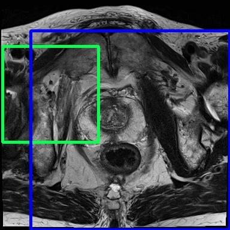
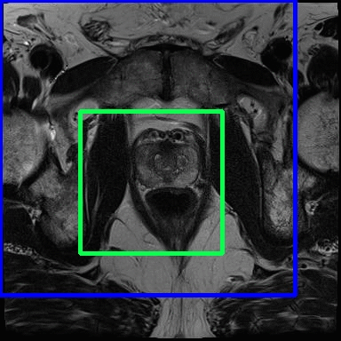

# Medical_Localization_RL
Localization with Reinforcement Learning on Medical Images (HKU IRIS group)

This is a work in progress research work focusing on localization of structures like lesions and lung capacities on MRI and X-ray images (The code is currently not up-to-date, latest code will be provided once results become published) 

# Illustration with Prostate-X dataset
 
